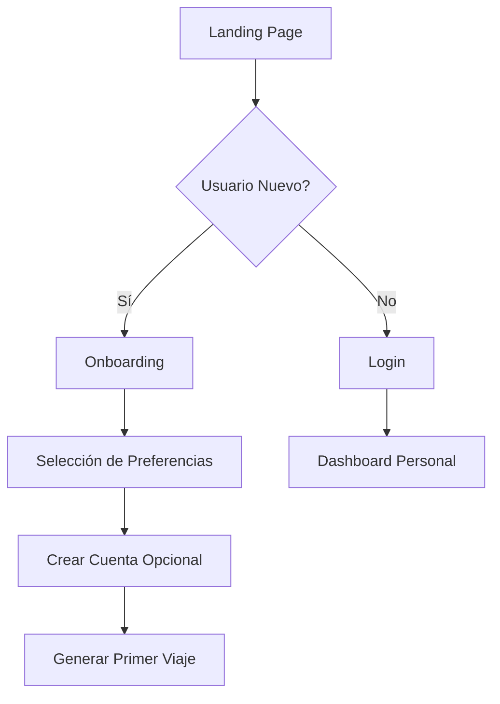

# GetRandomTrip - User Flow Documentation

## 🎯 Descripción General
GetRandomTrip es una aplicación web que genera destinos de viaje aleatorios para usuarios que buscan inspiración para sus próximas aventuras. La aplicación combina un frontend Next.js con un backend Node.js/Prisma para ofrecer una experiencia fluida y personalizada.

## 📋 Tabla de Contenidos
1. [Arquitectura de la Aplicación](#arquitectura-de-la-aplicación)
2. [Flujos de Usuario Principales](#flujos-de-usuario-principales)
3. [Flujos Detallados](#flujos-detallados)
4. [Estados de la Aplicación](#estados-de-la-aplicación)
5. [Componentes y Páginas](#componentes-y-páginas)
6. [API Endpoints](#api-endpoints)

---

## 🏗️ Arquitectura de la Aplicación

```
┌─────────────────────────────────────────────────────────┐
│                     Usuario (Browser)                    │
└────────────────────────┬────────────────────────────────┘
                         │
                         ▼
┌─────────────────────────────────────────────────────────┐
│                Frontend (Next.js + Tailwind)            │
│  ┌──────────────────────────────────────────────────┐  │
│  │ Pages: Home | Discover | Trip Details | Profile  │  │
│  └──────────────────────────────────────────────────┘  │
└────────────────────────┬────────────────────────────────┘
                         │
                         ▼
┌─────────────────────────────────────────────────────────┐
│              Backend API (Node.js + Prisma)             │
│  ┌──────────────────────────────────────────────────┐  │
│  │ Routes: /auth | /trips | /destinations | /users  │  │
│  └──────────────────────────────────────────────────┘  │
└────────────────────────┬────────────────────────────────┘
                         │
                         ▼
┌─────────────────────────────────────────────────────────┐
│                   Database (PostgreSQL)                  │
└─────────────────────────────────────────────────────────┘
```

---

## 🔄 Flujos de Usuario Principales

### 1. Flujo de Usuario Nuevo (First-Time User)


### 2. Flujo de Generación de Viaje Aleatorio
```mermaid
graph TD
    A[Home/Dashboard] --> B[Click "Get Random Trip"]
    B --> C{Tiene Preferencias?}
    C -->|Sí| D[Aplicar Filtros]
    C -->|No| E[Aleatorio Total]
    D --> F[Generar Destino]
    E --> F
    F --> G[Mostrar Resultado]
    G --> H{Le gusta?}
    H -->|Sí| I[Ver Detalles]
    H -->|No| J[Regenerar]
    I --> K[Guardar/Compartir]
    J --> F
```

---

## 📝 Flujos Detallados

### 🏠 1. Landing Page Flow

**Ruta:** `/`

**Acciones del Usuario:**
1. **Visualización inicial**
   - Hero section con CTA principal
   - Mensaje: "Descubre tu próximo destino de forma aleatoria"
   - Botón prominente: "Empezar Aventura"

2. **Interacciones disponibles:**
   - `Generar Viaje Sin Registro` → Flujo rápido
   - `Explorar Destinos` → Galería de destinos
   - `Crear Cuenta` → Proceso de registro
   - `Iniciar Sesión` → Login para usuarios existentes

### 🎲 2. Random Trip Generation Flow

**Ruta:** `/discover`

**Proceso paso a paso:**

```
PASO 1: Configuración Inicial (Opcional)
├── Presupuesto: [Bajo | Medio | Alto | Sin límite]
├── Duración: [Weekend | 1 Semana | 2 Semanas | 1 Mes+]
├── Tipo de Viaje: [Aventura | Relax | Cultural | Gastronómico]
└── Continente: [Cualquiera | América | Europa | Asia | África | Oceanía]

PASO 2: Generación
├── Click en "Generate Random Trip"
├── Animación de loading (ruleta/globo girando)
└── Revelación progresiva del destino

PASO 3: Resultado
├── Nombre del Destino
├── País y Región
├── Imagen destacada
├── Información básica:
│   ├── Mejor época para visitar
│   ├── Presupuesto estimado
│   ├── Actividades principales
│   └── Datos curiosos
└── Acciones:
    ├── "Me encanta" → Guardar
    ├── "Otro destino" → Regenerar
    └── "Ver más detalles" → Trip Details
```

### 📍 3. Trip Details Flow

**Ruta:** `/trip/{destination-id}`

**Secciones de información:**

1. **Overview**
   - Galería de imágenes
   - Descripción general
   - Mapa interactivo
   - Clima por temporada

2. **Planificación**
   - Itinerarios sugeridos (3, 5, 7 días)
   - Presupuesto desglosado
   - Mejores zonas para hospedarse
   - Transporte local

3. **Experiencias**
   - Top 10 actividades
   - Restaurantes recomendados
   - Vida nocturna
   - Compras y mercados

4. **Información Práctica**
   - Requisitos de visa
   - Vacunas necesarias
   - Moneda y cambio
   - Idioma y frases útiles
   - Números de emergencia

5. **Acciones del Usuario**
   - Guardar en favoritos
   - Compartir en redes sociales
   - Descargar PDF
   - Crear itinerario personalizado

### 👤 4. User Account Flow

**Rutas:** `/login`, `/register`, `/profile`

**Registro de Usuario:**
```
1. Información Básica
   ├── Email
   ├── Contraseña
   └── Nombre

2. Preferencias de Viaje (Opcional)
   ├── Estilos de viaje preferidos
   ├── Presupuesto habitual
   ├── Destinos bucket list
   └── Restricciones (dietéticas, movilidad, etc.)

3. Verificación
   └── Email de confirmación
```

**Perfil de Usuario:**
```
/profile
├── Información Personal
├── Preferencias de Viaje
├── Historial de Búsquedas
├── Destinos Guardados
├── Viajes Planificados
└── Configuración de Notificaciones
```

### 🔍 5. Search & Filter Flow

**Ruta:** `/explore`

**Filtros Disponibles:**
- **Por Región:** Continente, País, Ciudad
- **Por Presupuesto:** Rangos predefinidos
- **Por Actividad:** Playa, Montaña, Ciudad, Naturaleza
- **Por Temporada:** Mejor época actual
- **Por Duración:** Escapada, Semana, Largo plazo
- **Por Tipo:** Solo, Pareja, Familia, Grupos

---

## 🎯 Estados de la Aplicación

### Estados Globales
```javascript
{
  user: {
    isAuthenticated: boolean,
    profile: UserProfile | null,
    preferences: UserPreferences | null
  },
  currentTrip: {
    destination: Destination | null,
    isLoading: boolean,
    error: string | null
  },
  savedTrips: Trip[],
  filters: {
    budget: string,
    duration: string,
    type: string,
    continent: string
  }
}
```

### Estados de Componentes

**Loading States:**
- Generando destino (animación de ruleta)
- Cargando detalles
- Guardando favorito
- Procesando filtros

**Error States:**
- No hay conexión
- Error al generar destino
- Destino no disponible
- Error de autenticación

**Success States:**
- Destino generado exitosamente
- Guardado en favoritos
- Compartido exitosamente
- Perfil actualizado

---

## 🧩 Componentes y Páginas

### Páginas Principales

| Página | Ruta | Componentes Clave |
|--------|------|-------------------|
| Home | `/` | Hero, QuickStart, Features, Testimonials |
| Discover | `/discover` | FilterBar, RandomButton, DestinationCard |
| Trip Details | `/trip/:id` | ImageGallery, InfoTabs, ActionButtons, Map |
| Explore | `/explore` | SearchBar, FilterSidebar, DestinationGrid |
| Profile | `/profile` | UserInfo, SavedTrips, Preferences, Settings |
| Login | `/login` | LoginForm, SocialLogin, ForgotPassword |
| Register | `/register` | SignupForm, PreferencesWizard |

### Componentes Reutilizables

```
components/
├── common/
│   ├── Navigation
│   ├── Footer
│   ├── LoadingSpinner
│   └── ErrorBoundary
├── trip/
│   ├── TripCard
│   ├── TripDetails
│   ├── TripGallery
│   └── TripMap
├── user/
│   ├── UserAvatar
│   ├── PreferencesForm
│   └── SavedTripsGrid
└── ui/
    ├── Button
    ├── Modal
    ├── Toast
    └── Carousel
```

---

## 🔌 API Endpoints

### Authentication
```
POST   /api/auth/register     - Crear cuenta
POST   /api/auth/login        - Iniciar sesión
POST   /api/auth/logout       - Cerrar sesión
POST   /api/auth/refresh      - Renovar token
POST   /api/auth/forgot       - Recuperar contraseña
```

### Trips
```
GET    /api/trips/random      - Generar viaje aleatorio
GET    /api/trips/:id         - Obtener detalles del viaje
GET    /api/trips/search      - Buscar viajes
POST   /api/trips/save        - Guardar viaje
DELETE /api/trips/:id         - Eliminar viaje guardado
```

### User
```
GET    /api/user/profile      - Obtener perfil
PUT    /api/user/profile      - Actualizar perfil
GET    /api/user/preferences  - Obtener preferencias
PUT    /api/user/preferences  - Actualizar preferencias
GET    /api/user/saved-trips  - Listar viajes guardados
```

### Destinations
```
GET    /api/destinations      - Listar todos los destinos
GET    /api/destinations/:id  - Detalles del destino
GET    /api/destinations/featured - Destinos destacados
GET    /api/destinations/trending - Destinos en tendencia
```

---

## 🎨 Consideraciones de UX/UI

### Principios de Diseño
1. **Mobile-First:** Optimizado para dispositivos móviles
2. **Accesibilidad:** WCAG 2.1 AA compliance
3. **Performance:** Lazy loading, optimización de imágenes
4. **Interactividad:** Animaciones suaves, feedback inmediato
5. **Personalización:** Adaptación según preferencias del usuario

### Elementos Interactivos Clave
- **Botón "Spin the Globe":** Animación 3D del globo terráqueo
- **Reveal Animation:** Efecto dramático al mostrar el destino
- **Swipe Gestures:** En móvil para rechazar/aceptar destinos
- **Interactive Map:** Zoom, pan, puntos de interés
- **Social Sharing:** Preview cards optimizadas para cada red

### Métricas de Éxito
- Time to First Trip: < 30 segundos
- Conversion Rate: Visitante → Usuario registrado
- Engagement: Viajes generados por sesión
- Retention: Usuarios que vuelven en 7 días
- Sharing: Destinos compartidos en redes sociales

---

## 📱 Responsive Breakpoints

```css
/* Mobile First Approach */
- Mobile: 320px - 767px
- Tablet: 768px - 1023px
- Desktop: 1024px - 1439px
- Large Desktop: 1440px+
```

---

## 🔐 Seguridad y Privacidad

### Autenticación
- JWT tokens con refresh tokens
- OAuth 2.0 para social login
- 2FA opcional
- Rate limiting en endpoints sensibles

### Datos del Usuario
- Encriptación de datos sensibles
- GDPR compliance
- Opción de eliminar cuenta y datos
- Export de datos personales

---

## 🚀 Próximas Funcionalidades (Post-MVP)

1. **Planificador de Itinerarios con IA**
2. **Integración con APIs de vuelos y hoteles**
3. **Comunidad y reviews de usuarios**
4. **Modo offline con PWA**
5. **Realidad Aumentada para explorar destinos**
6. **Gamificación (badges, challenges)**
7. **Travel buddy matching**
8. **Budget tracker integrado**

---

## 📊 Analytics y Tracking

### Eventos a Trackear
```javascript
// Eventos principales
track('trip_generated', { destination, filters_used })
track('trip_saved', { destination_id, user_id })
track('trip_shared', { destination_id, platform })
track('user_registered', { registration_method })
track('filter_applied', { filter_type, filter_value })
track('detail_viewed', { destination_id, source })
```

---

## 🎯 User Personas

### 1. El Aventurero Espontáneo
- **Edad:** 25-35 años
- **Comportamiento:** Busca inspiración rápida, decide sobre la marcha
- **Necesita:** Sugerencias rápidas, información concisa

### 2. El Planificador Meticuloso
- **Edad:** 35-55 años
- **Comportamiento:** Investiga a fondo, compara opciones
- **Necesita:** Detalles completos, itinerarios, presupuestos

### 3. El Viajero con Presupuesto
- **Edad:** 20-30 años
- **Comportamiento:** Prioriza el costo, busca ofertas
- **Necesita:** Filtros de presupuesto, tips de ahorro

---

*Última actualización: [Fecha actual]*
*Versión: 1.0.0 MVP*